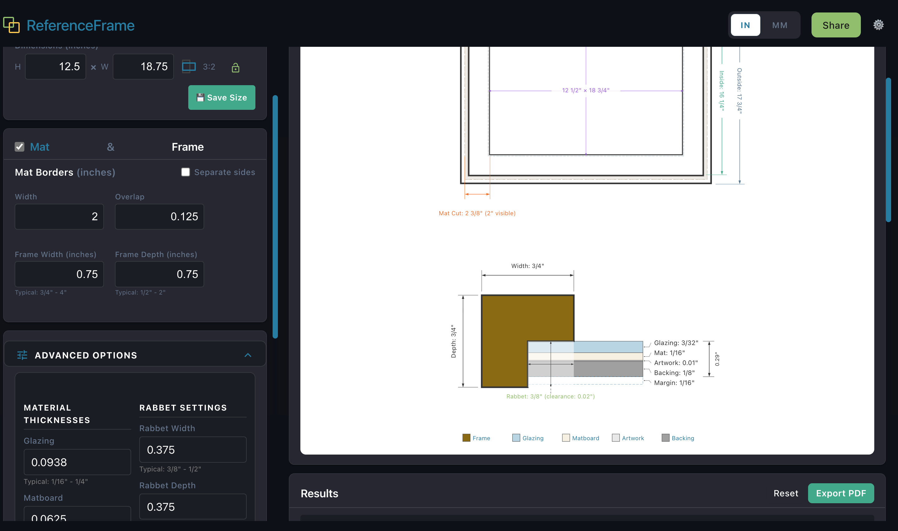

# ReferenceFrame

A cross-platform picture frame design calculator built with a shared Rust core.



**Web:** https://glarue.github.io/ReferenceFrame
**iOS:** https://apps.apple.com/us/app/referenceframe/id6758589669

## Architecture

ReferenceFrame uses a **shared Rust core** for maximum code reuse across platforms:

```
ReferenceFrame/
├── core/                      # Pure Rust business logic (platform-agnostic)
│   ├── src/                   # Frame calculations, validation, SVG generation
│   ├── data/presets.json      # Single source of truth: presets, defaults, colors
│   └── Cargo.toml
│
├── platforms/
│   ├── web/                   # Web app (WASM)
│   │   ├── wasm_bindings/     # Thin WASM wrapper
│   │   ├── index.html         # Web UI
│   │   ├── styles.css
│   │   └── pkg/               # Generated WASM output
│   │
│   └── mobile/                # Flutter app (iOS; Android planned)
│       ├── lib/               # Dart/Flutter UI
│       ├── rust/              # flutter_rust_bridge FFI layer
│       └── ios/               # Xcode project + Fastlane
│
├── hooks/                     # Shared git hooks (conventional commits)
├── release.sh                 # Conventional-commit version bumping
├── build_wasm.sh              # WASM build script
└── legacy/pyscript/           # Archived original PyScript version
```

## Features

- Full frame design calculations (dimensions, cut list, depth analysis)
- Interactive SVG visualizations (plan view + section view)
- Professional PDF export with embedded vector diagrams
- Unit conversion (inches with fractions, decimal, mm)
- Customizable color-coded dimension categories
- Saved configurations and design history
- Configurable defaults and material presets

**Web-only:** Shareable URLs (28-byte encoded designs), QR codes in PDFs
**iOS-only:** Native share sheet, color customization UI, dark mode

## Development

**Core library** (all platforms):
```bash
cd core
cargo test --lib       # 146 unit tests
```

**Web:**
```bash
./build_wasm.sh        # Build WASM bindings to platforms/web/pkg/
cd platforms/web
python3 serve.py       # Local server at http://localhost:8887
```

**iOS:**
```bash
cd platforms/mobile
./rebuild.sh run       # Detects Rust changes, rebuilds, launches on device/sim
```

## Tech Stack

| Layer | Technology |
|---|---|
| Core | Rust (pure, no platform dependencies) |
| Web | Rust → WASM via wasm-bindgen |
| iOS | Rust → FFI via flutter_rust_bridge → Flutter |
| Visualization | SVG generation in Rust (vector, crisp at any zoom) |
| PDF (web) | jsPDF + svg2pdf.js |
| PDF (iOS) | Dart `pdf` package with embedded SVG |

## Deployment

**Web:** Automatically deployed to GitHub Pages on push to `main`. Workflow in `.github/workflows/deploy.yml` builds WASM and deploys static files (~45s).

**iOS:** Built and uploaded via Fastlane from `platforms/mobile/ios/`. Version bumping handled by `release.sh` using conventional commit prefixes.

## Versioning

`release.sh` scans conventional commits and bumps semver independently per scope:

| Scope | Version file | Tag |
|---|---|---|
| core | `core/Cargo.toml` | `core-v*` |
| app | `platforms/mobile/pubspec.yaml` | `app-v*` |
| bridge | `platforms/mobile/rust/Cargo.toml` | `bridge-v*` |

```bash
./release.sh           # Dry run
./release.sh --apply   # Bump, commit, and tag
```

## License

MIT OR Apache-2.0
