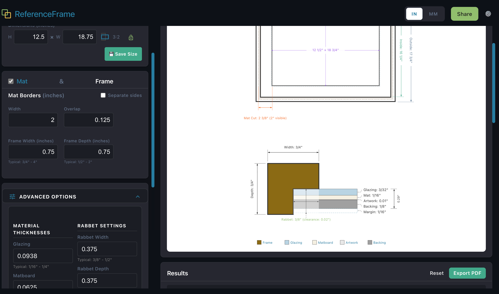

# ReferenceFrame

A picture-frame design calculator for woodworkers, built on a shared Rust core.

[](https://apps.apple.com/us/app/referenceframe/id6758589669)

**Web app:** https://glarue.github.io/ReferenceFrame



## Features

- **Frame math:**
  - opening, rabbet, and matboard sizes
  - cut list (inside and outside lengths of the mitered pieces) and total wood
  - depth stack (glazing, mat, art, backing) against rabbet depth
- **Frame styles:**
  - traditional **rabbet**, where the lip overlaps the art
  - **sight-size**, where the opening equals the art and the lip holds oversized glazing and backing
  - float frames are planned (`FLOAT_FRAME_PLAN.md`)
- **Mats:** symmetric or separate top/bottom and side widths, with configurable overlap.
- **Assembly clearance:** "cut to fit" sizes for glazing, backing, and the mat's outer edge.
- **Joinery and hanging:**
  - spline (corner key) slot planning
  - D-ring placement and picture-wire length
  - both are optional diagram layers
- **Weight estimate** from sourced material densities, with wire tension.
- **Constraint notices:** input the design can't physically hold (for example, a rabbet wider than the moulding allows) is clamped by one shared core policy. You get a short explanation of each clamp. User-editable validation limits catch the rest.
- **Diagrams:** vector plan and section views generated in Rust, with light and dark themes.
- **Units:** inches (fractions or decimal) or mm. All math is done in inches.
- **Output:**
  - PDF export with the diagrams and a QR code linking to the design
  - a plain-text cut list (web)
- **Saving:** saved configurations, design history, customizable dimension colors, and presets from a single `core/data/presets.json`.

### Platform differences

| | Web | iOS |
|---|---|---|
| Share links (`?d=…`) | create and open | create (in the PDF QR code and share sheet) |
| Print stylesheet, copy cut list to clipboard | yes | — |
| Live animated preview, pinch-zoom/pan, diagram detail levels | — | yes |
| Haptics, native share sheet, custom defaults at launch | — | yes |

Share links use a compact binary format: currently **v2**, 39 bytes, base64url
in the `?d=` parameter. Links in the older v0 and v1 formats still decode.

## Architecture

```
core/                   Pure Rust business logic + SVG generation (all platforms)
  data/presets.json     Single source of truth: defaults, presets, limits, palette
platforms/web/          Web app: index.html + styles.css + wasm_bindings/ (WASM wrapper)
platforms/mobile/       Flutter iOS app (separate git repo): lib/, rust/ (FFI bridge), ios/ (Fastlane)
hooks/                  Shared commit-msg hook (conventional commits)
scripts/                check_presets_drift.py (cross-platform SSOT check, runs in CI)
release.sh              Conventional-commit version bumping (core / app / bridge)
build_wasm.sh           WASM build → platforms/web/pkg/
legacy/pyscript/        Archived original PyScript version
docs/                   Plans (docs/plans/) and archived docs (docs/archive/)
```

See [ARCHITECTURE.md](ARCHITECTURE.md) for the module layout, key concepts,
and the build and release flow.

## Development

**One-time setup** (after cloning): turn on the shared commit-msg hook. It enforces conventional commits.
```bash
git config core.hooksPath hooks/
# The mobile repo points its own core.hooksPath at this same hooks/ directory
```

**Core** (all platforms):
```bash
cd core && cargo test          # unit + edge-case + golden SVG + doctests
python3 scripts/check_presets_drift.py
```

**Web:**
```bash
./build_wasm.sh                              # always from the repo root → platforms/web/pkg/
node --test platforms/web/storage.test.mjs   # storage.js tests
cd platforms/web && python3 serve.py         # http://localhost:8887
```

**iOS:**
```bash
cd platforms/mobile
./rebuild.sh run      # rebuilds Rust when core/bridge sources change, then flutter run
flutter test          # Dart tests; `cd rust && cargo test` for the bridge
```

## Tech Stack

| Layer | Technology |
|---|---|
| Core | Rust (pure, no platform dependencies) |
| Web | Rust → WASM via wasm-bindgen |
| iOS | Rust → FFI via flutter_rust_bridge → Flutter |
| Visualization | SVG generated in Rust |
| PDF (web) | jsPDF + svg2pdf.js |
| PDF (iOS) | Dart `pdf` package with embedded SVG |

## Deployment

**Web:** every push to `main` deploys to GitHub Pages through `.github/workflows/deploy.yml`, if the tests pass. The workflow builds the WASM and stamps the commit SHA into the cache-busting URLs and service-worker caches of the deployed copy.

**iOS:** built and uploaded with Fastlane from `platforms/mobile/ios/`. See `platforms/mobile/RELEASING.md` in the mobile repo.

## Versioning

`release.sh` scans conventional commits and bumps semver independently per scope:

| Scope | Version file | Tag |
|---|---|---|
| core | `core/Cargo.toml` | `core-v*` |
| app | `platforms/mobile/pubspec.yaml` | `app-v*` |
| bridge | `platforms/mobile/rust/Cargo.toml` | `bridge-v*` |

```bash
./release.sh           # Dry run
./release.sh --apply   # Bump, commit, and tag (refuses on a dirty tree)
```

## License

MIT OR Apache-2.0
